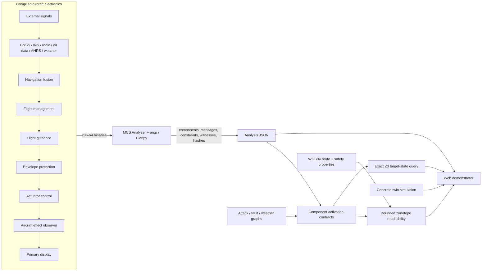
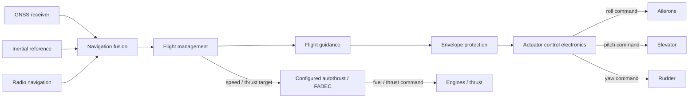

# ALBATROS Aviation Demonstrator Architecture

## Purpose

This demonstrator applies the existing Multi-Component System (MCS) Analyzer
to an aircraft electronics mock-up and then connects its binary-derived
message chains to a bounded physical aircraft model.

The separation is intentional and follows the scope of
`Identifying_Critical_Failure_Chains_for_Resilience_in_Cyber-Physical_Systems_using_Symbolic_Execution.pdf`:

- MCS Analyzer discovers feasible software-level message flows and their path
  constraints from compiled binaries.
- The aircraft reachability layer composes those contracts with time and a
  simplified physical plant. Physical plant dynamics are not claimed as an
  MCS Analyzer capability.

The result is a research demonstrator, not certifiable avionics software and
not an operational navigation tool.

## Acceptance criteria

1. The aircraft electronics are compiled native programs, not UI-only boxes.
2. A real angr run analyzes every configured native component and exports a
   machine-readable artifact with binary hashes, constraints, causal
   productions, and run provenance.
3. Secure and vulnerable aircraft use the same route, environment, dynamics,
   and injected scenario. Only documented safeguard decisions differ.
4. True physical state, sensor/FMS-estimated state, and commanded state remain
   separate throughout the simulation.
5. Position reachability always states its input bounds, finite horizon, time
   step, model, and over-approximation semantics.
6. A secure result is reported as bounded-safe only when the entire computed
   reach tube lies within the configured property.
7. An unsafe result includes a concrete, replayable boundary-input trace.
8. Binary MCA feasibility, physical reachability, and attack likelihood are
   presented as different result types.
9. A user-selected unsafe aircraft state can be queried backward. SAT results
   include bounded input witnesses and MCA-linked enabling scenarios; UNSAT
   results identify the finite model scope and native safeguards that block the
   relevant message chains.

## System overview



## Native avionics layer

The native layer lives in `bin/aviation`. All payloads use fixed-width,
fixed-point encodings so angr can reason about the same comparisons that the
runtime model presents to the user.

| Component | Approximate aircraft responsibility | Analyzer role |
| --- | --- | --- |
| GNSS Receiver | Validate and publish a WGS84 GNSS fix | External source |
| Inertial Reference System | Publish an independent, drifting position reference | External source |
| Radio Navigation Receiver | Publish an independent radio-derived position | External source |
| Air Data Computer | Publish altitude, vertical speed, and airspeed | External source |
| Attitude and Heading Reference | Publish pitch, roll, and heading | External source |
| Weather Radar | Publish bounded wind/turbulence/icing information | External source |
| Navigation Fusion | Apply source consistency and degraded-mode selection | Processor / safeguard |
| Data Loader System | Accept an EFB/DLS-originated route-load word | Boundary source |
| Route Integrity Monitor | Verify route provenance and geographic corridor before activation | Safeguard |
| Control-Domain Ingress | Emit explicitly untrusted navigation or guidance traffic | Boundary source |
| AFDX Ingress Guard | Reject or republish an untrusted virtual-link payload | Safeguard / vulnerable gateway |
| Radio Altimeter 1 | Publish a labelled radio-height value or invalid state | External source |
| Radio Altimeter 2 | Publish a redundant radio-height value or invalid state | External source |
| Dual Radio-Height Monitor | Select either valid channel and report unavailable only when neither is valid | Safeguard |
| Flight Management System | Convert accepted position and flight plan to guidance targets | Processor |
| Flight Guidance Computer | Shape lateral and vertical commands | Processor |
| Envelope Protection | Limit pitch and bank authority independently | Safeguard |
| Actuator Control Electronics | Enforce mechanical travel and drive the surface command | Processor |
| Aircraft Dynamics Effect | Classify the one-step software-visible effect | Safety sink |
| Primary Flight Display | Consume and annunciate terminal states | Sink |

The secure and vulnerable builds are compiled from the same sources with a
controlled profile macro. This avoids accidental architecture drift between
the comparison aircraft.

### Secure profile

- Cross-source navigation consistency with INS preferred over radio and GNSS.
- Invalid or inconsistent GNSS is rejected and recorded as a navigation alert.
- Modified route/map data is rejected by the native route-integrity component.
- Untrusted navigation and guidance virtual-link traffic is rejected by the
  native AFDX ingress guard.
- Either valid radio-altimeter channel can supply the selected radio height;
  an unavailable result is emitted only when neither side is valid.
- An independent envelope component always limits bank to 32 degrees and
  pitch to 18 degrees.
- Actuator travel checks remain independent of the software flight envelope.

### Vulnerable profile

- Syntactically valid GNSS can receive navigation authority without sufficient
  consistency checks.
- Modified route data can become the active FMS leg.
- Untrusted control-domain traffic can be republished as authoritative
  navigation or guidance.
- Radio-height selection depends on channel 1 and therefore loses availability
  even when channel 2 remains valid.
- A defective direct-navigation mode can bypass the normal software envelope.
- Mechanical travel remains wider than the intended flight envelope, allowing
  a software error to cause a real unsafe command.

## Logical aircraft bus

The component names and channels are inspired by ARINC 664 Part 7 / AFDX
virtual links, with ARINC-429-like labelled sensor paths where the supplied
radio-altimeter case calls for them. The analysis harness transports one
64-bit message identifier and one 64-bit payload through `scanf`/`printf`
hooks because that is the existing analyzer's supported interface.

This is not a bit-accurate AFDX or ARINC-429 implementation. In particular,
the MCS logical bus has no frame timing, BAG scheduling, redundancy management,
parity, collisions, freshness, message aging, or network latency. Those fields
only influence a result if explicitly represented in component logic.

## Analysis pipeline

1. Compile both native profiles for x86-64 with debug symbols, no optimization,
   reproducible non-PIE code, and retained message-ID symbols.
2. Start the existing coordinator in headless mode for the secure profile.
3. Symbolically execute each component once with unconstrained inputs to learn
   its subscriptions and possible outputs.
4. Re-execute actionable components with satisfiable messages from the logical
   bus until a fixed point or analysis budget is reached.
5. Snapshot the bus before teardown and export components, messages,
   productions, communication edges, Claripy expressions, constraints,
   message traces, binary/config hashes, and tool versions.
6. Repeat in a clean process for the vulnerable profile.
7. Validate expected secure/vulnerable safety findings before publishing the
   artifacts to `web/public/analysis`.

The web page never invents the MCA component graph. It loads the generated
analysis artifacts. Scenario animation adds runtime state to those static
feasible dependencies but does not rewrite the underlying MCA result.

The system view aggregates repeated symbolic message instances into directed
component-pair transitions for legibility. Selecting an edge chooses a
configured-source message where possible and reconstructs its component lineage
from the exported `traces` data. A violated `safety_findings` record can therefore
highlight the exact MCA witness chain. Solid edges are analyzer-derived AFDX
communication; dashed edges and boundary nodes are configured scenario steps
and are never presented as angr-proven communication.

The inspector joins transitions, messages, and constraint records by exported
`message_id`. Predicates inside one message record are conjunctive; separate
message records and trace alternatives remain alternative feasible paths. The
default readable view decodes only known aviation payload layouts and component
contracts. A collapsible full view preserves the analyzer's exact Claripy text.
Here, “full” means every output-payload-relevant predicate retained in the
exported IO state, not every internal angr `SimState` constraint. The readable
view is explicitly a presentation aid rather than a solver-checked equivalent.

Configured scenario guards such as `scenario armed AND time >= T+90s AND
phase in {climb, cruise, descent}` remain visually separate from angr evidence.
When a dotted scenario edge has the same
source and target as a solid MCA transition, the inspector presents the two as
configured runtime evidence and correlated binary evidence, respectively.
Concrete unsafe witnesses are decoded from the fixed-point message ABI even
when no symbolic constraint record exists for the terminal message.

## Physical state model

### Forward command-to-actor architecture

The system visualization extends the native message graph to the physical
actors at the end of the control chain. GPS, INS, and radio navigation visibly
influence navigation fusion and therefore every downstream lateral command.
The native actuator electronics command the ailerons, elevator, and rudder. A
configured autothrust/FADEC relation translates the FMS speed/thrust target
into an engine command.



The control surfaces and engines are terminal graph nodes and never publish a
return edge. This keeps causal explanations strictly left-to-right. Solid
AFDX/message transitions remain analyzer-derived; dashed terminal command
edges are configured relations added only to a display copy. They never enter
the exported angr/MCA evidence or component count. The separate simulator and
aircraft-state panel still compute and display the resulting motion.

The runtime and bounded model keep distinct values for:

- true aircraft position and attitude;
- GNSS, INS, radio, air-data, and attitude measurements;
- fused navigation/FMS estimated position;
- requested guidance;
- envelope-protected command;
- actuator state.

GPS spoofing therefore changes the estimated state first. A true geographic
diversion occurs only after the corrupted estimate reaches FMS, flight
guidance, envelope/actuator logic, and the physical transition.

The concrete browser simulation uses rate-limited airspeed, runway-aligned
ground roll, and a coordinated-turn relation at the current true airspeed:

```text
airspeed[k+1]   = rateLimit(airspeed[k], phaseTargetSpeed, acceleration * dt)
roll[k+1]       = roll[k] + response * (rollCommand[k] - roll[k])
yawRate[k+1]    = g * tan(roll[k+1]) / max(trueAirspeed[k+1], minimumSpeed)
heading[k+1]    = heading[k] + yawRate[k+1] * dt
position[k+1]   = WGS84Project(routeDistance[k+1], crossTrack[k+1])
```

The vertical channel keeps pitch `theta`, flight-path angle `gamma`, and angle
of attack `alpha` distinct. A bounded target vertical speed produces a target
flight-path angle. Each flight phase supplies a simple transport-aircraft trim
AoA, and pitch follows `theta = gamma + alpha`. Vertical speed is integrated
from the air-relative flight-path angle rather than directly from pitch:

```text
targetVS[k]       = clamp(profileVS[k] + altitudeErrorGain * altitudeError[k])
gammaTarget[k]    = asin(targetVS[k] / max(trueAirspeed[k], minimumSpeed))
alphaTarget[k]    = phaseTrimAoA(flightPhase[k])
pitchTarget[k]    = gammaTarget[k] + alphaTarget[k]
pitch[k+1]        = pitch[k] + response * (pitchTarget[k] - pitch[k])
alpha[k+1]        = alpha[k] + response * (alphaTarget[k] - alpha[k])
gammaAir[k+1]     = pitch[k+1] - alpha[k+1]
verticalSpeed     = trueAirspeed[k+1] * sin(gammaAir[k+1]) + verticalGust[k]
gammaGround[k+1]  = atan2(verticalSpeed, horizontalGroundSpeed)
altitude[k+1]     = altitude[k] + verticalSpeed * dt
```

The ALB displays `alpha` as **angle of attack / Anstellwinkel** and the
ground-trajectory `gamma` as **flight-path angle / Steigungswinkel**. The AoA
trim is an intentionally lightweight phase model, not a stall, lift-coefficient,
or full aerodynamic model. In still air and negligible sideslip, the displayed
relationship is `pitch theta = flight path gamma + AoA alpha`; vertical gust can
separate the air-relative and ground-relative angles.

The route altitude is therefore a guidance target, not a value copied into the
aircraft state. Explicit ground-roll, rotation, climb, cruise, descent,
approach, and landed phases select plausible speed and vertical-rate limits.
Local along-track/cross-track metres are projected onto the configured WGS84
route for display.

An independent plant guard remains wider than the configurable safety
predicates so an unsafe demonstration is still possible without numerical
runaway. For the short regional research routes it limits absolute altitude to
20,000 ft, true airspeed to 330 kt, indicated airspeed to 400 kt, bank to
55 degrees, pitch to 25 degrees, angle of attack to 12 degrees, and yaw rate to
10 degrees per second. Route-specific climb and descent rates remain tighter.
When the altitude or energy limit is reached, achieved vertical speed,
flight-path angle, pitch, and angle of attack are reconciled in the same step;
the display cannot show a continuing climb through the ceiling.

This is deliberately understandable and solver-friendly. It is not a full
six-degree-of-freedom aerodynamic model.

## Bounded reachability semantics

The statement “all possible positions” means:

> every state represented by the component contracts and every external input
> within the displayed bounds, for the displayed finite horizon and time step.

The engine propagates a zonotope through the linearized transition system.
Each independent sensor error, spoof bias, route offset, command injection,
bounded stale command, wind, or gust adds a generator. Linear propagation
retains cross-state correlations that plain interval iteration would lose.
Saturation adds an explicit residual generator. A direct or stale command that
replaces nominal feedback adds enough residual authority to contain both the
feedback and replacement branches. Every proof step is retained, and both
deterministic boundary replays are checked to remain inside the published tube.

Consequences:

- If the complete tube is inside a safety limit, the property is bounded-safe
  for this model.
- If a concrete boundary replay crosses a limit, the property is unsafe and
  the replay is a witness.
- If only the conservative tube crosses a limit, the result is unknown rather
  than unsafe; a wider abstraction can produce false alarms.
- No result makes a claim about inputs outside the configured bounds or time
  beyond the configured horizon.

The user-configurable properties are maximum absolute roll, pitch, yaw rate,
cross-track deviation, and altitude deviation. Explicit functional contracts
also report FMS steering freshness, safe navigation reversion, and selected
radio-height availability where relevant; these are not fabricated as pitch or
altitude errors. The requested “32% roll” is interpreted as 32 degrees of bank;
the unit is always shown in the UI.

The concrete flight simulation uses the global mission clock and enforces each
phase/AGL gate directly. Reachability instead uses a local scenario-relative
window: all selected operating gates and preconditions are assumed satisfied,
and bounded effects enter at local T+30 s. This prevents a 180 s local analysis
from silently omitting an approach or late-flight event. Signed runtime actions
are symmetrized into independent uncertainty radii for the “any input within
the bound” claim. FMS-denial and total-navigation-loss checks explicitly bound
the last accepted command to ±12 degrees bank and ±8 degrees pitch. The local
plant does not automatically evolve takeoff-to-landing flight phases.

### Backward unsafe-state query

The inverse endpoint uses the same bounded symbolic transition relations but
constrains a requested aircraft state instead of asking whether a threshold is
crossed. A conservative reach enclosure first removes impossible time steps;
the remaining same-time target conjunction is checked with Z3 after equality
elimination. Background INS, radio, and along-track nuisance variables are held
nominal so a returned witness is attributable to the named attack or weather
input rather than silently spending unrelated uncertainty.
The local inverse altitude error is referenced to the 12,000-ft route cruise
level, so its positive target range stops at +8,000 ft under the demonstrator's
20,000-ft operating ceiling.

For each profile the response distinguishes:

- **SAT**: a concrete bounded input sequence reaches all selected target fields
  at one proof step;
- **UNSAT**: the target is excluded within the declared attacks, bounds, step,
  and horizon; and
- **unknown**: the exact solver could not decide after enclosure filtering.

Individual scenarios are checked before a larger composed query, allowing the
UI to say whether one chain is sufficient or a combination is required.
Scenario metadata joins the witness to native component IDs and message types.
Blocked steps identify secure safeguards such as the AFDX ingress guard and
envelope protection. This composition does **not** claim that angr itself
solves continuous flight dynamics: angr/MCA proves component-message
feasibility, while the target-state relation is the declared bounded plant.

## Scenario model

The catalog expands the paper-grounded threat and safety trees into ten
aircraft scenarios plus one clearly labelled environmental extension:

1. lone GNSS carry-off spoofing;
2. GNSS spoofing after independent loss of radio navigation and INS position;
3. coordinated, mutually consistent GNSS and radio-navigation deception;
4. tampering with the post-fusion navigation-system output;
5. preflight EFB/DLS route tampering whose altered leg activates in flight;
6. forged control-domain guidance traffic at the AFDX-inspired ingress;
7. denial, replay, or excessive delay of FMS steering updates;
8. total navigation-position availability loss and monitored attitude reversion;
9. unauthorized MCDU altitude-target modification;
10. one-side radio-altimeter/ARINC-429 invalidity below 2,500 ft during approach;
11. bounded convective crosswind and gust as a plant-only demonstrator extension.

Every scenario declares its signal property, attack surface, preconditions,
operating window, detection cues, safety hazard, causal dependencies, phase or
height gate, rise/hold/fall profile, and evidence binding. A preflight
compromise can therefore remain **armed** until an affected leg becomes active,
and an altitude-radio fault remains **armed** until approach below its AGL
gate. Finite injections recover after their configured hold and decay instead
of remaining permanently active.

Evidence coverage is explicit:

- **native** means every stated aircraft-side transition is represented by an
  analyzed binary and named message type;
- **partial** means the aircraft-side handlers are native but an external
  exploit, correlation, timing, or ordered precondition is configured;
- **configured** means the runtime effect is bounded and replayable but is not
  a complete native MCA chain; and
- **plant** means a physical disturbance outside the binary message model.

MCA displays functional message feasibility without claiming likelihood or
real-time ordering. The runtime timeline applies the declared causal and
flight-state guards; the scenario-relative reach model states its gate
assumption separately. A scenario magnitude such as a 4.5 km GNSS bias is a
runtime/reachability bound; the angr run ranges over the native fixed-point
input domain and does not silently treat that magnitude as a solver premise.

## Web application

The Flask service provides configuration, real MCA artifacts, analyzer reruns,
bounded forward reachability, and inverse target-state queries. The React page
provides:

- a real WGS84 map with the planned route, actual and estimated positions,
  nose-forward aircraft markers, heading vectors, side-by-side tracks, and
  reachable tubes;
- play, pause, reset, time scale, route selection, and attack selection;
- secure/vulnerable attitude indicators, flight-phase/VSI telemetry, and a
  planned-versus-actual vertical flight profile;
- attack-stage timeline and component propagation graph;
- dynamically editable safety limits;
- an interactive, searchable MCA component/transition graph with synchronized
  details, alternate layouts, scenario overlays, keyboard-selectable
  transitions, and exported origin traces;
- selection-scoped readable constraint explanations, exact captured Claripy
  records, decoded concrete witnesses, hashes, evidence tables, and run status;
- reachability classification and concrete witnesses;
- a live aircraft-state panel beside the terminal actuator graph and a backward unsafe-state workbench with
  attributable input witnesses and secure blocking components;
- explicit scope/limitation labels.

## Source traceability

- MCS phases, persistent logical bus, solver-backed messages, constraints, and
  limitations: `Identifying_Critical_Failure_Chains_for_Resilience_in_Cyber-Physical_Systems_using_Symbolic_Execution.pdf`,
  especially PDF pp. 2-6.
- Aircraft domains, navigation source trust order, threat-scenario tree,
  EFB/DLS attack paths, and radio-altimeter fault tree:
  `Albatros_D2.5_v0.2.pdf`, report pp. 38-57 and 68-70.
- FMS hazards and original EFB connectivity variants:
  `Dont_Panic_Analysing_the_Impact_of_Attacks_on_the_Safety_of_Flight_Management_Systems.pdf`,
  PDF pp. 2-9.

## Known limitations

- The MCA implementation can miss paths under finite exploration budgets.
- “Not found” is not reported as proof of impossibility.
- Analyzer I/O provenance is message-level, not a real-time bus schedule.
- The geographic routes are research demonstration paths between real
  aerodromes, not current ATC clearances.
- OpenStreetMap tiles require network access; the route/state data remains
  available if tiles cannot load.
- Probability values from the papers are not mixed with the local feasibility
  and physical reachability results.
- This software is unsuitable for flight planning, control, certification, or
  operational safety decisions.
